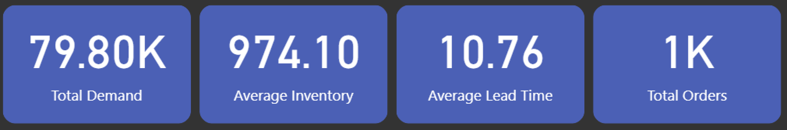

# AI-Driven Demand Forecasting & Inventory Optimization (Power BI)

## Project Overview
This project presents an end-to-end supply chain analytics solution built using Power BI. The dashboard analyzes demand forecasting accuracy, inventory efficiency, supplier performance, and cost distribution to support data-driven operational decisions.

## Business Objectives
- Forecast SKU-level demand using multiple methods
- Optimize inventory using EOQ, safety stock, and reorder points
- Identify cost drivers across suppliers and regions
- Improve service levels while reducing overstock and stockouts

## Dashboard Highlights
- KPI Overview: Total Demand, Avg Inventory, Avg Lead Time, Total Orders
- Demand vs Forecast trend analysis
- Inventory efficiency by region
- Cost distribution across suppliers
- Interactive filters by region and time

## Key Insights
- Forecast models show varying accuracy across regions and SKUs
- Entire regions with better lead time consistency show higher inventory efficiency
- Supplier S04 contributes the largest cost share
- Clean inventory policies reduce overstock while maintaining 100% fill rate

## Tools & Skills
- Power BI (DAX, Data Modeling, Visualization)
- Demand Forecasting (Moving Avg, Exp Smoothing, Prophet, XGBoost)
- Inventory Optimization (EOQ, Safety Stock)
- Excel & Python (for preprocessing)

## Dataset
- Simulated supply chain dataset
- Time period: Jan–Apr 2024
- Metrics include demand, forecast error, inventory, lead time, cost, and logistics risk

## Dashboard Preview

## Power BI Report
> Add your Power BI public link here

## Outcome
This project demonstrates practical application of analytics to real-world supply chain challenges using BI tools and forecasting techniques.
